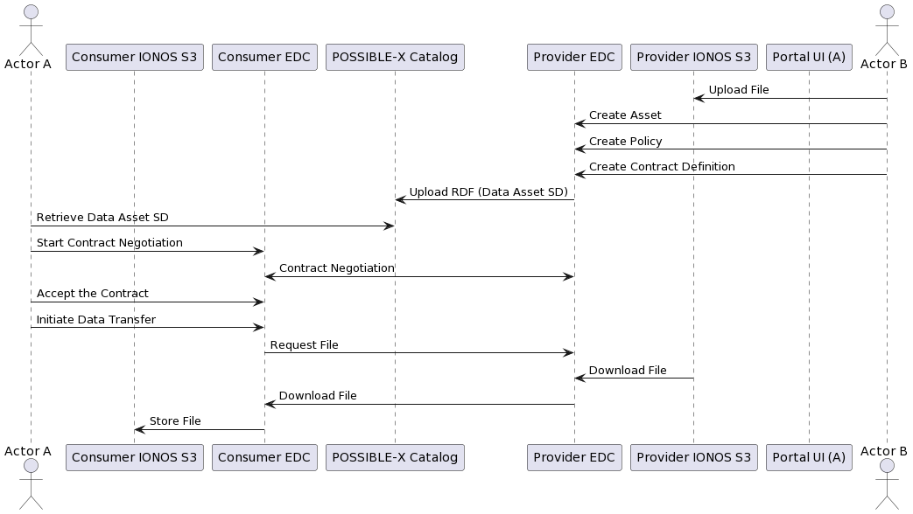

# Tasks

## Create a bash script to simulate step5 **Upload RDF (Data Asset SD)** from the diagram below.

### Frauenhofer Catalog resources
- [documentation](https://doc.piveau.io/general/introduction/)
- [running instance](https://possible.fokus.fraunhofer.de/datasets) of Frauenhofer Catalog
- 
