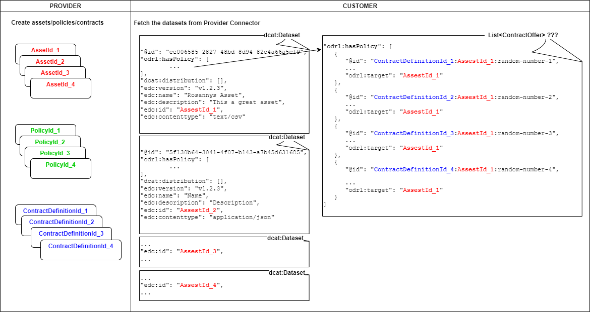

# HACKATHON 4 (2023-08-04)

## Issues during the hackathon
- The asset ID, policy ID, and the contract offering ID were created by the Provider and stored in the Provider Connector and the POSSIBLE-X Catalogue (https://possible.fokus.fraunhofer.de/provider?locale=en).
- However, these IDs are not the same with the IDs needed for the contract negotiation and transfer process (https://possible.fokus.fraunhofer.de/consumer?locale=en).

## After-Hackathon Analysis

### 1.1 Creating an Asset, a Policy, a Contract Offering
When a provider creates an asset, a policy, and a contract offering through the [Provider View](https://possible.fokus.fraunhofer.de/provider?locale=en),
an ID is generated for each component and these IDs are stored in the Provider Connector.
This action will also add a new dataset (POSSIBLE Data Resource) to the [POSSIBLE-X Catalogue](https://possible.fokus.fraunhofer.de/catalogues/test-provider?locale=en),
where asset ID is stored in `possible-x:assetId`, policy ID in `possible-x:uid`, and contract offering ID in `possible-x:contractOfferId`.
In this catalogue, a Consumer can see and consume offers from Providers.

### 1.2 Findings and Suggestions

#### Provider Connector
A list of existing `dcat:Dataset` can be fetched by calling the following POST request:
```
curl --location 'http://85.215.202.38:8182/management/v2/catalog/request' \
--header 'Content-Type: application/json' \
--header 'x-api-key: password' \
--data-raw '{
      "@context": {
        "edc": "https://w3id.org/edc/v0.0.1/ns/"
      },
      "providerUrl": "http://85.215.202.163:8281/protocol",
      "protocol": "dataspace-protocol-http"
    }'
```
Currently (09.08.2023), we can see there are 4 `dcat:Dataset` and each dataset has an `@id` AND an `edc:id`.
This `edc:id` is what we know as the asset ID.

#### Contract Definition
`Step 3 - Create ContractOffering` on the [Provider View](https://possible.fokus.fraunhofer.de/provider?locale=en) is misleading.
This step should be called Contract Definition, as the endpoint name suggests (`/management/v2/contractdefinitions`), because this step only associates policies to a selection of assets to generate the contract offers that will be put in the Provider Catalog.
In our hackathon case, [the selection is empty](https://github.com/POSSIBLE-X/documentation/blob/6348ad6d263c272b8365ab1623e2dcaca4177e0f/hackathon2/G02.sh#L122C28-L122C28), so every asset is attached to these policies ([#Ref](https://github.com/eclipse-edc/Samples/tree/main/transfer/transfer-06-consumer-pull-http#5-create-a-contract-definition-on-provider)).

#### Contract Offer
A `dcat:Dataset` in the Provider Connector also has a list called `odrl:hasPolicy`, which as far as I understand is the [list of the Contract Offer](https://github.com/eclipse-edc/Connector/blob/main/spi/common/catalog-spi/src/main/java/org/eclipse/edc/catalog/spi/Catalog.java#L35).
From this list we can see that each `dcat:Dataset` is associated with every Contract Definition, creating a Contract Offer with `@id`.
__This `@id` is the value that should be stored as the `possible-x:contractOfferId` in POSSIBLE Data Resource in POSSIBLE-X Catalogue__, as it is required for contract negotiation.
<mark>We have 2 alternatives to quickly fix our current issue:</mark>
- Since an asset can have multiple contract offers, store all associated contract offer IDs in `possible-x:contractOfferId`. When the Customers want to consume this asset, let them pick just one ID.
- Just pick one contract offer ID and store it in `possible-x:contractOfferId`.

The figure below gives a simplified illustration about the data structure in Provider Connector.



#### Contract Negotiation
To negotiate a contract, the consumer must send a contract offer to the provider. To simplify the contract negotiation process, currently this __MUST be equal to the provider's offer__.
([#Ref](https://github.com/eclipse-edc/Samples/tree/main/transfer/transfer-07-provider-push-http#6-negotiate-a-contract),
[#Ref](https://github.com/eclipse-edc/Samples/discussions/77#discussioncomment-6371195)).
Therefore, in POSSIBLE-X Catalogue [Consumer View](https://possible.fokus.fraunhofer.de/consumer?locale=en) :
- `Policy ID` should be replaced with `Contract Offer ID`.
- To make it even more clear, `Offer ID` can be renamed with `Consumer's Offer ID`
- The same Contract Offer ID must be used in `Consumer's Offer ID` and `Contract Offer ID` fields.

#### POSSIBLE-X Catalogue
[POSSIBLE Data Resource](https://possible-x.github.io/documentation/catalog/self-descriptions/#possible-data-resource) should be restructured, to better reflect the relation between a dataset and Contract Offers.
As the Provider Connector suggests, a dataset can have multiple contract offers, if the Provider choose to do so (see Contract Definition).

## Conclusion
1. Both Provider and Consumer Views should be modified to clear up the confusion and avoid misunderstanding.
2. Under our current process, whenever an asset is created in Provider Connector, the existing contract definitions are automatically attached to this new asset, creating a new contract offer. Therefore, it is not necessary to create a new policy and new contract definitions immediately after creating a new asset.
   - Likewise, if an asset already exists, creating a new contract definition will automatically create a new contract offer.
   - When Provider Connector generates a new contract offer, the ID should also be stored in POSSIBLE-X Catalogue.